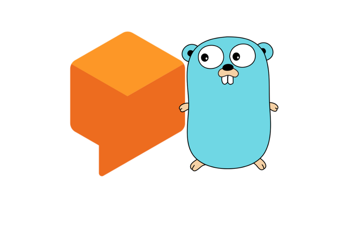

# go-dialogflow
<div align="center">
	
</div>
A Go library that provides basic functionality for interfacing with the Dialogflow v2 API without having to use the online UI. This allows for the complete automation of creating and editing agents and their parameters (intents, entities, etc.) via scripting. Only basic operations are implemented, but more functionality will be added in the future.

Dialogflow's old v1 API is [set to be deprecated](https://dialogflow.com/docs/reference/v1-v2-migration-guide) on 23 October 2019 and the few existing libraries were all written for v1; this v2 library was created out of necessity to avoid having to migrate between versions after just a few months of use.

* [Prerequisites](#prerequisites)
* [Installation](#installation)
* [Usage](#usage)
* [Documentation](#documentation)
* [License](#license)

## Prerequisites
Create a [DialogFlow account](https://dialogflow.com/).

## Installation
```shell
go get -u github.com/richardred/go-dialogflow
```

## Usage
Create a service account at https://console.developers.google.com/apis/credentials, save the generated credentials file (keys.json in this repository), and use it to create an authenticated Dialogflow API client.

```golang
data, err := ioutil.ReadFile("keys.json") //replace keys.json with your own service account credentials file
if err != nil {
  log.Fatal(err)
}
conf, err := google.JWTConfigFromJSON(data, scope)
if err != nil {
  log.Fatal(err)
}
DialogflowClient := conf.Client(oauth2.NoContext)
...
DialogflowClient.Get("https://...")
```
This authentication process uses [JWTConfigFromJSON](https://godoc.org/golang.org/x/oauth2/google#example-JWTConfigFromJSON), which obtains an access token from the imported credentials. It provides a layer of abstraction by automating the authorization code/access token exchange process and skipping the usual 'user consent' phase of the OAuth 2.0 flow, which automates the entire process without requiring any manual input.

There are several other ways to obtain a valid access token, but this one was the most fitting for creating a Dialogflow API client.

## Built With
* [Google API Go Client](https://github.com/googleapis/google-api-go-client) - auto-generated Go libraries from the Google Discovery Service's JSON description files of the available "new style" Google APIs. (Due to the auto-generated nature of this collection of libraries, complete APIs or specific versions can appear or go away without notice)

* [Google Go Library](https://godoc.org/golang.org/x/oauth2/google) - provides support for making OAuth2 authorized and authenticated HTTP requests to Google APIs. Supports the Web server flow, client-side credentials, service accounts, Google Compute Engine service accounts, and Google App Engine service accounts

* [Dialogflow APIv2](https://cloud.google.com/dialogflow/docs/reference/rest/v2-overview) - builds conversational interfaces (for example, chatbots, and voice-powered apps and devices)

## Documentation
Documentation is available at https://dialogflow.com/docs.

## License
This project is licensed under the MIT License - see the [License](LICENSE) file for details
